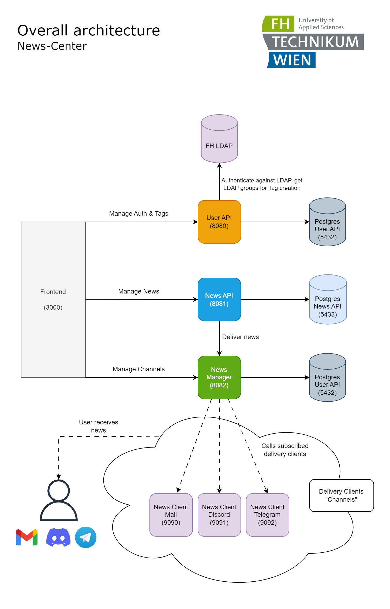

# news-kraken

<p align="center">

</p>

# Overall architecture


News-Center serves as a proficient news delivery system, catering to the needs of students and other users by providing them with pertinent messages across configurable platforms such as Discord. To offer a clearer understanding of the overall architecture, a simplified view is depicted below:

<p align="center">

</p>

# Relevancy detection

How do we detect if a message is relevant? 
The mechanism employed to determine the relevance of a message involves a multi-phase algorithm centered around the message's tags. Subsequently, the liked messages of users are taken into consideration before the messages are delivered.

<p align="center">

</p>

Users have the flexibility to subscribe to phases 1 through 7, enabling them to control which phases are applied. In the user interface, these phases are commonly referred to as "Matching-Algorithms." This customization empowers users to tailor their experience based on their preferences and desired level of relevance.

# Setup

**news-kraken** enables us to run the entire NewsCenter-Backend within a single dockerized application that runs with
multiple docker containers. Before you can use kraken you have to do the following steps:

* Clone all relevant repos (with ssh, not https) from
  the [News-Center-Organisation](https://github.com/News-Center). <br/>
  **MAKE SURE YOU CLONE THEM ALL INTO THE SAME DIRECTORY**.<br/>
  As of now those repos are:
    * [user-api](https://github.com/News-Center/user-api)
    * [news-api](https://github.com/News-Center/news-api)
    * [news-manager](https://github.com/News-Center/news-manager)
    * [news-client-email](https://github.com/News-Center/news-client-email)
    * [news-kraken](https://github.com/News-Center/news-kraken)
* Enter the news-kraken directory
* Create your .env file in the root of the news-kraken directory:
    * To a obtain dummy smtp email handle you may use [ethereal](https://ethereal.email/messages)

```
EMAIL_LOGIN = "<YOUR-EMAIL>"
EMAIL_PASSWORD = "<YOUR-PASSWORD>"
EMAIL_HOST = "<YOUR-HOST>"
TELEGRAM_TOKEN = YOUR-TOKEN
DISCORD_TOKEN = YOUR-TOKEN
...

```

# Start the Services

There are three ways to start the services:

1) Using your own `launch.bat` file (relevant for Frontend)
2) Using `make`
3) Using docker compose

## 1) Launch.bat file

Create your own launch script. For this copy the `launch-example.bat` file and modify the `basePath`:

```
REM basePath anpassen!
set "basePath=C:\PATH\TO\ALL\REPOS\"
...
```

Now you can execute your launch file by simply clicking on it. It will update and start all services for you.
If you just wish to start everything but don't want to update the repos run `docker-compose up` manually.

## 2) Make

**Starting all services:**
Using make:

```
make up
```

***Note:*** In order to run make commands you need to have `make` installed on your machine. If you are using Windows
you can install
the Linux Subsystem and run the make commands from there (run `ubuntu run` to enter a Linux terminal).

**Starting Databases only:**
Using make:

```
make db
```

## 3) Docker Compose

Using docker compose:

```docker
docker compose up
```

Using docker compose:

```docker
docker compose up postgres_user_api postgres_news_api --build --force-recreate
```

# Note

**Please keep in mind:**

* For looking at the logs of a particular container I recommend using Docker Desktop.
* The Frontend is not included with this. The Frontend is a React-Application and its repo is hosted on Azure.
